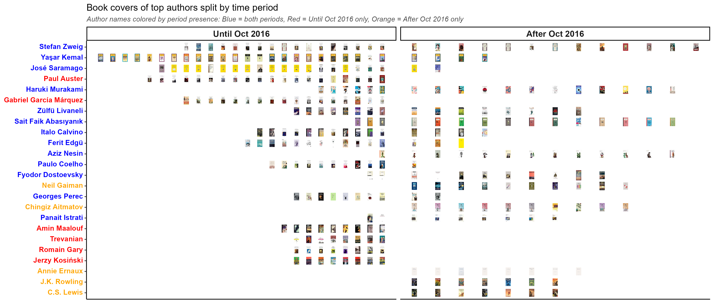

# Goodreads Scraping & Creating Different Statistics and Plots
This project utilizes [`goodreads_selenium_python.py`](https://github.com/afelka/goodreads/blob/main/goodreads_selenium_python.py) to scrape book data from Goodreads. The collected data is then analyzed and visualized using [`goodreads.R`](https://github.com/afelka/goodreads/blob/main/goodreads.R).  
Below are some example visualizations generated from the data:

**Books by Page Interval:**  
 

**My Average Ratings per 50 Books:**  
 

**Top 10 Read Authors:**  
 

**Top 10 Read Authors Last 800 Books:**  
 

**Top 10 Read Authors in Split Periods:**  
 

