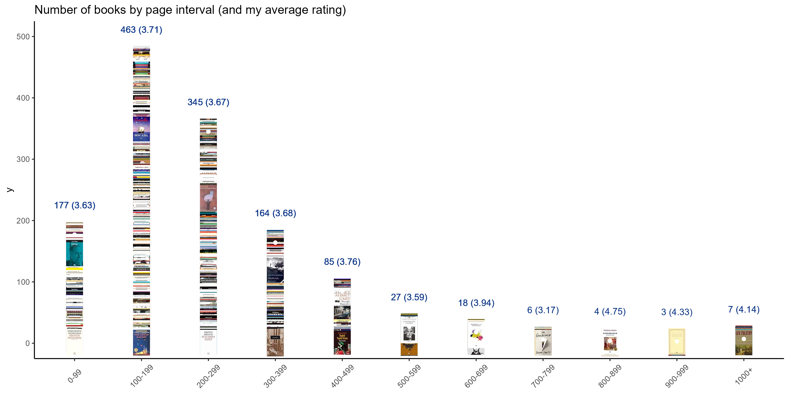
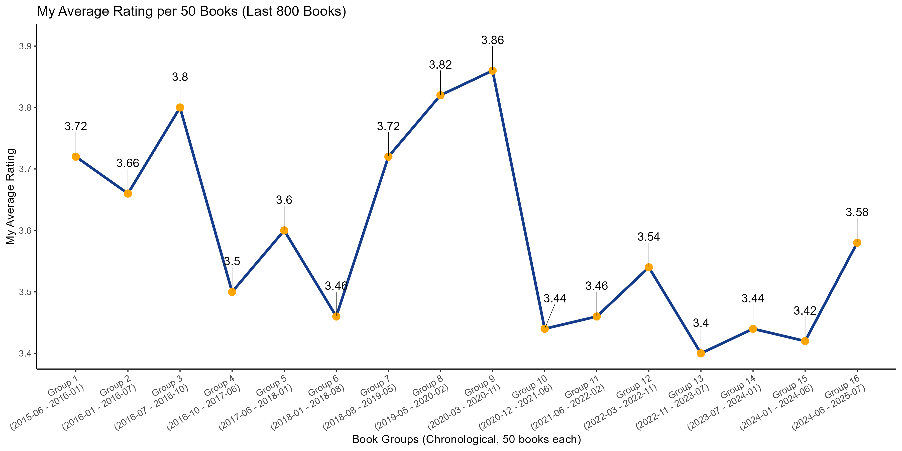
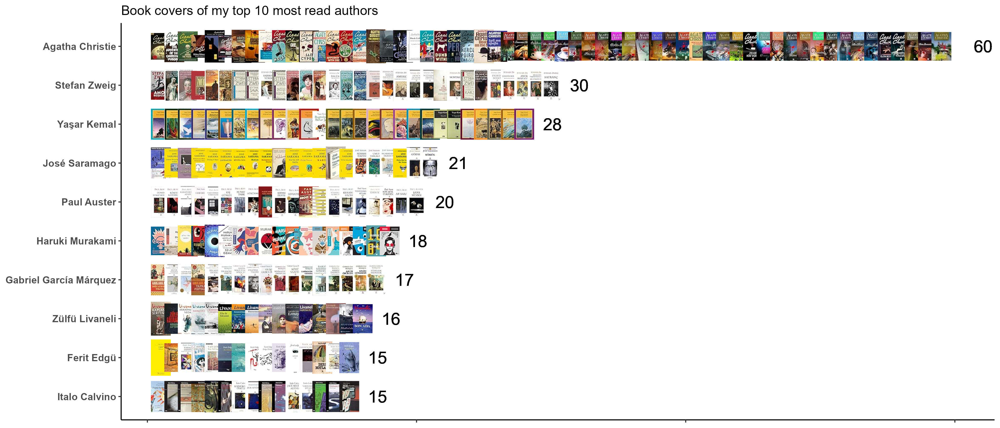
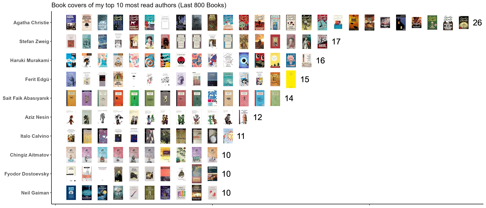

# Goodreads Scraping & Creating Different Statistics and Plots
This project uses [`goodreads_selenium_python`](https://github.com/ozbek/goodreads_selenium_python) to scrape data from Goodreads. All statistics and plots are generated using [`Goodreads.R`](Goodreads.R).  
Example visualizations can be found below:

**Books by Page Interval:**  
 

**My Average Ratings per 50 Books:**  
 

**Top 10 Read Authors:**  
 

**Top 10 Read Authors Last 800 Books:**  
 

